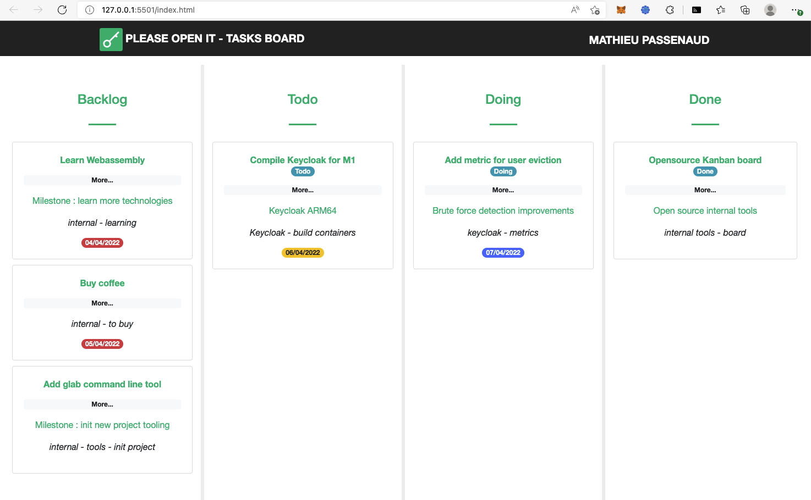

# Gitlab Kanban board

## Create a key

In your gitlab preferences, go to "access token", then generate an access token with "api" scope. Copy this token.

## Use board

Open index.html, add your token created previously in a parameter ?token=

This app renders your issues (not closed) as a Kanban board with 3 tags : 

- Todo
- Doing
- Done

The backlog contains all opened issues without those 3 tags.

Each card can be moved.